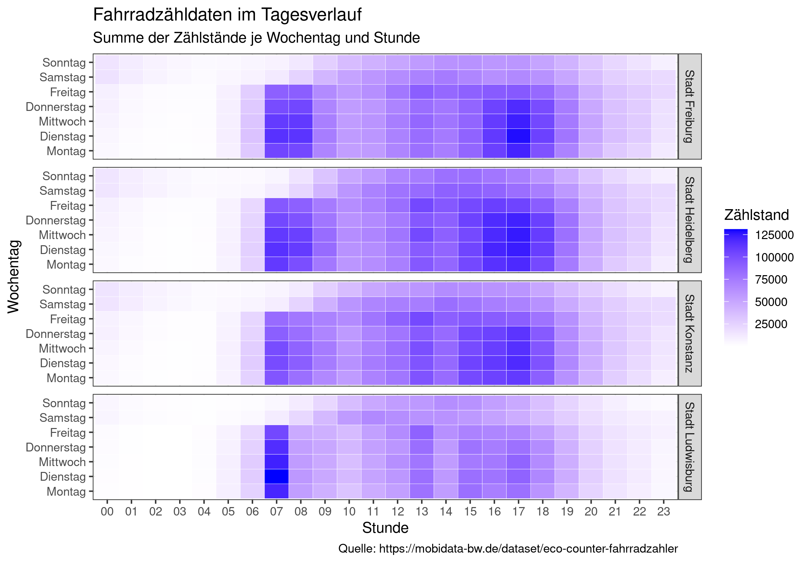

# Bike Counter Baden-Württemberg

Analyzing data from bike counter in various cities in Baden-Württemberg. Using Open Data from https://mobidata-bw.de/dataset/eco-counter-fahrradzahler.

## Historical Data

Searching for trends in data, starting in 2021:

[fahrrad_zaehldaten_bw_historisch.R](historisch/fahrrad_zaehldaten_bw_historisch.R)

## Real Time Data

Built Shiny App to show real time data (past 7 days to now) on app.

[fahrrad_zaehldaten_bw.R](fahrrad_zaehldaten_bw_app/fahrrad_zaehldaten_bw.R)

